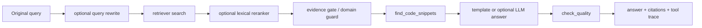

# DevAgent-RAG

面向 AI 开发文档检索与报错诊断的本地 Agentic RAG 项目。系统使用 LangGraph 编排任务路由、错误解析、文档检索、代码示例检索、证据门控、回答生成与质量检查，并输出 citation 和 tool trace。

项目默认使用本地 template answer，不需要任何大模型 API，可直接复现测试、CLI demo、评估和 Streamlit 页面。OpenAI-compatible API 仅作为可选的最终回答生成能力，不参与文档检索。

## Project Overview

DevAgent-RAG 接收技术问题或报错日志，从 OpenAI、LangChain/LangGraph、PyTorch、HuggingFace、vLLM、LLaMAFactory 等文档中检索依据，生成带引用的回答。系统支持内置 sample docs，也支持从本地 `external/` 目录导入真实公开文档仓库。

当前已使用 LLaMA-Factory 真实文档完成本地验证：

- `46` documents
- `487` chunks
- `30` imported documents
- `458` LLaMAFactory chunks

这些数字只描述当前本地验证语料，不代表生产规模或线上效果。

## Why This Project

AI 开发问题既包括 API/框架用法，也包括 CUDA OOM、依赖缺失、dtype mismatch 和 API key 配置等错误日志。单次“检索后生成”难以稳定处理不同任务，也容易把真实文档中的弱相关词误当成证据。

本项目重点验证以下工程问题：

- 如何用显式工作流区分技术问答与报错诊断。
- 如何比较关键词、语义和混合检索。
- 如何让回答携带可追溯 citation 和 tool trace。
- 如何在真实文档引入噪声后识别弱相关 evidence 并拒答。
- 如何在无 API key 时保持项目完整可运行。

## Key Features

- LangGraph Agentic RAG workflow。
- `doc_qa`、`error_debug`、`code_lookup`、`config_help` 展示层任务类型。
- TF-IDF、sentence-transformers embedding、hybrid retrieval。
- Optional query rewrite 和 lexical reranker，默认关闭。
- Markdown、MDX、TXT、Jupyter Notebook 加载与标题/代码块切分。
- 外部公开文档导入、metadata manifest 和索引统计。
- CUDA OOM、`ModuleNotFoundError`、API key 缺失、`RuntimeError` 解析。
- Evidence gate、domain guard 和 no-evidence refusal。
- Template answer 与可选 OpenAI-compatible LLM Answer。
- Citation、quality report、retrieved chunks 和 JSONL tool trace。
- CLI、Streamlit、本地评估和三模式检索对比报告。

## Optional Retrieval Enhancement

新增的检索增强能力是可选的，默认关闭，不影响原始 demo 和默认 evaluation。

- Query rewrite：把长 traceback 或噪声报错日志压缩成更适合检索的 `search_query`，例如将长 `ModuleNotFoundError` traceback 压缩为依赖安装和 import error 相关关键词。
- Lexical reranker：在初检 top-k candidates 后做轻量二次排序，参考 query/document 关键词重叠、错误类型关键词和原始 retrieval score。
- 两者均为 rule-based / lexical 实现，不引入新模型，不需要联网，也不依赖额外大模型。
- Evidence gate、domain guard 和 no-evidence refusal 仍然保留，检索增强不会绕过拒答逻辑。

## Architecture



核心流程：

```text
original query
  -> optional query rewrite
  -> retriever search
  -> optional lexical reranker
  -> evidence gate
  -> answer generation
  -> quality check
```

LangGraph 节点层面的流程：

```text
route_task -> parse_error / retrieve_docs -> evidence gate
           -> find_code_snippets -> generate_answer -> check_quality
```

API 只出现在 `generate_answer` 阶段。TF-IDF、embedding、hybrid retrieval、query rewrite 和 lexical reranker 均在本地完成。

## Quick Start

```bash
python -m venv .venv
pip install -r requirements.txt
python scripts/prepare_sample_docs.py
python scripts/build_index.py
```

Windows PowerShell 可使用：

```powershell
.\.venv\Scripts\Activate.ps1
```

## Run Tests

```bash
python -m unittest discover -s tests -v
```

当前回归测试覆盖 loader、splitter、三种 retrieval、Agent workflow、evidence gate、query rewrite、lexical reranker、external import、LLM fallback、Web utils 和评估报告。测试通过只说明当前受控场景行为符合预期。

## Run Demo

```bash
python scripts/run_demo.py
python scripts/debug.py "CUDA out of memory"
python scripts/ask.py "How to handle OpenAI rate limits?"
python scripts/evaluate.py
python scripts/retrieval_eval.py
```

推荐完整演示流程见 [DEMO_SCRIPT.md](docs/DEMO_SCRIPT.md)。

## Streamlit Web Console

```bash
streamlit run app.py
```

本地控制台支持：

- 上传 `.md`、`.mdx`、`.txt`、`.ipynb`。
- 导入 GitHub 文档仓库并重建索引。
- 选择 retrieval mode、top-k 和 answer mode。
- 查看 task type、answer backend、quality report、citation、chunk 和 tool trace。
- 运行并预览 Agent eval 与 retrieval eval。

Web UI 是本地展示与操作入口，核心逻辑仍位于 `src/` 和 `scripts/`，未实现多用户权限、认证或公网部署安全能力。

## External Docs Import

默认 sample docs 可离线运行。真实文档不会提交仓库，需要手动 clone 到 `external/`：

```bash
git clone https://github.com/openai/openai-cookbook external/openai-cookbook
git clone https://github.com/langchain-ai/docs external/langchain-docs
git clone https://github.com/pytorch/tutorials external/pytorch-tutorials
git clone https://github.com/hiyouga/LLaMA-Factory external/llamafactory

python scripts/prepare_external_docs.py
python scripts/build_index.py
```

导入器限制文件类型、文件大小和每个 source 的数量，并跳过 `.git`、assets、build、dist、虚拟环境等目录。`external/`、`data/docs_imported/` 和 `data/index/` 已被 `.gitignore` 忽略。

## Retrieval Modes

在 `configs/default.yaml` 中配置：

```yaml
retrieval:
  mode: tfidf
  top_k: 3
  min_score: 0.05
  embedding_model: sentence-transformers/all-MiniLM-L6-v2
  hybrid_alpha: 0.5
```

| Mode | 说明 | 适用特点 |
|---|---|---|
| `tfidf` | sklearn TF-IDF baseline | 精确关键词、错误名、配置项，默认且无需模型下载 |
| `embedding` | sentence-transformers + NumPy cosine similarity | 语义改写与近义表达 |
| `hybrid` | min-max normalization 后融合两类分数 | 兼顾关键词匹配和语义召回 |

Embedding 模型不可用时会给出原因并回退 TF-IDF，不中断默认主流程。

## Retrieval Enhancement Config

Query rewrite 和 reranker 默认关闭：

```yaml
query_rewrite:
  enabled: false
  mode: rule_based

reranker:
  enabled: false
  mode: lexical
  top_k: 3
```

开启后，`query_rewrite_info` 和 `reranker_info` 会写入 state / tool trace，便于调试和面试展示。默认 evaluation 没有启用这两个模块。

## Optional LLM Answer

API 是可选能力。没有 `OPENAI_API_KEY` 时，demo 和测试仍可完整运行，`run_llm_demo.py` 会自动回退 template answer。

```bash
python scripts/check_llm_config.py
python scripts/run_llm_demo.py
```

环境变量：

```text
OPENAI_API_KEY
OPENAI_BASE_URL=https://api.openai.com/v1
OPENAI_MODEL=gpt-4o-mini
```

LLM 只能使用通过 evidence gate 的文档片段，并被要求保留 citation。无有效 evidence 时直接拒答，不调用 API。详细配置见 [API_USAGE.md](docs/API_USAGE.md)。

## Evaluation

```bash
python scripts/evaluate.py
python scripts/retrieval_eval.py
```

主要指标：

- Route accuracy
- Retrieval hit rate、Hit@1、Hit@3
- Retrieval non-empty rate 和 valid evidence hit rate
- Unsupported query refusal rate
- Citation rate、quality pass rate、tool success rate

当前默认 evaluation 未启用 query rewrite / reranker，因此默认指标代表原始稳定流程。新增模块通过独立单测和验证脚本验证，不夸大为整体指标提升。

最近一次本地验证结果：

```text
Unit tests:
Ran 76 tests, OK

Default evaluate:
route_accuracy: 100.0%
retrieval_hit_rate: 92.3%
citation_rate: 100.0%
quality_pass_rate: 86.7%
tool_success_rate: 100.0%
hit_at_1: 92.3%
hit_at_3: 92.3%
unsupported_refusal_rate: 100.0%

Retrieval eval:
tfidf Hit@1: 92.3%, Hit@3: 92.3%
embedding Hit@1: 100.0%, Hit@3: 100.0%
hybrid Hit@1: 100.0%, Hit@3: 100.0%
```

评测使用固定 sample cases。即使某些指标达到 100%，也只代表当前小型受控评测集，不代表真实生产质量。

输出文件：

- `data/output/eval_report.json` / `eval_report.md`
- `data/output/retrieval_eval.json` / `retrieval_eval.md`
- `data/output/demo_results.md`
- `data/output/llm_demo_results.md`
- `data/output/tool_trace.jsonl`
- `data/output/index_stats.json`

## How to Verify Retrieval Enhancements

运行以下脚本可以单独观察检索增强效果：

```powershell
.venv\Scripts\python.exe scripts/verify_reranker.py
.venv\Scripts\python.exe scripts/verify_query_rewrite_reranker.py
```

验证脚本不会修改默认配置文件，会在脚本内部构造临时 config，对比：

- query rewrite 关闭 / 开启。
- lexical reranker 关闭 / 开启。
- 长 traceback 的 `search_query` 压缩效果。
- `query_rewrite_info` / `reranker_info` 是否出现在结果中。
- unsupported query 是否仍然触发 no-evidence refusal。

## Interview Talking Points

- 为什么需要 query rewrite：长 traceback 和噪声日志会稀释检索关键词，rule-based rewrite 可以把问题压缩为更稳定的 `search_query`。
- 为什么需要 reranker：初检 top-k 可能包含弱相关 chunk，lexical reranker 可以用错误类型、库名和关键词重叠做轻量二次排序。
- 为什么默认关闭：两者都会改变检索路径；默认关闭可以保证现有 demo、eval 和测试的稳定复现。
- 为什么 evidence gate 仍然重要：rewrite 和 reranker 只能改善召回或排序，不能证明文档支持回答；最终仍需要 no-evidence refusal 和 domain guard。
- 如何验证没有破坏原流程：跑全量 unittest、默认 `evaluate.py`、`retrieval_eval.py`，并用验证脚本对比开关行为。

## Project Stages

项目从 V1 的 LangGraph + TF-IDF MVP，逐步增加拒答与评估、可选 LLM、embedding/hybrid、真实文档导入、Streamlit、evidence gate、query rewrite 和 lexical reranker。完整记录见 [PROJECT_STAGES.md](docs/PROJECT_STAGES.md)。

## Limitations

- 不是生产级知识平台，未实现账号、权限、审计和在线服务治理。
- External docs 和评测集规模有限，缺少持续更新与版本一致性管理。
- Router、error parser、query rewrite 和 reranker 主要依赖确定性规则，覆盖范围有限。
- Evidence gate 使用关键词类别和阈值，可能产生误拒答或漏拒答。
- Hybrid alpha、检索阈值和 reranker 权重尚未基于大型标注集调优。
- LLM 输出尚未实现严格的 citation entailment 验证与成本统计。

## Future Work

- 基于更大真实问答集调优阈值、hybrid 权重和 reranker 权重。
- 增加 citation entailment 检查。
- 支持增量索引、文档版本管理和更稳定的 embedding cache。
- 完善可观测性、性能测试、权限隔离与安全评估。
- 将规则 router 与 LLM/classifier router 做可解释对比实验。

## Project Materials

- [面试话术](docs/INTERVIEW_NOTES.md)
- [中英文简历 Bullet](docs/RESUME_BULLETS.md)
- [演示脚本](docs/DEMO_SCRIPT.md)
- [API 配置说明](docs/API_USAGE.md)
- [项目阶段](docs/PROJECT_STAGES.md)
