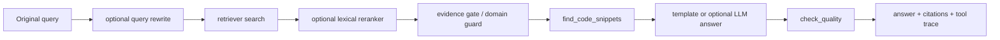

# DevAgent-RAG

Local Agentic RAG pipeline for AI developer documentation and error-log diagnostics.

The project uses LangGraph to route questions, parse common error logs, retrieve local documentation chunks, apply evidence checks, and generate citation-backed answers. It runs offline by default with sample documents and TF-IDF retrieval. Optional components include sentence-transformers retrieval, hybrid retrieval, query rewrite, lexical reranking, Streamlit UI, and OpenAI-compatible answer generation.

## Project Overview

DevAgent-RAG accepts technical questions or error logs and searches documentation related to OpenAI, LangChain/LangGraph, PyTorch, HuggingFace, vLLM, and LLaMAFactory. The system keeps retrieval, error parsing, answer generation, quality checks, citations, and tool traces as explicit steps.

The repository includes sample documents for offline runs. It can also import public documentation cloned manually into `external/`. A local validation run with LLaMA-Factory documentation produced:

- `46` documents
- `487` chunks
- `30` imported documents
- `458` LLaMAFactory chunks

These numbers describe one local corpus snapshot and should not be read as deployment scale.

## Why This Exists

AI development support questions often mix framework usage, API configuration, dependency issues, CUDA memory errors, and long traceback logs. A single retrieve-then-generate path can over-answer when a weakly related chunk happens to match a few words. This project keeps the routing, evidence checks, and refusal behavior visible and testable.

The main engineering goals are:

- Keep the RAG workflow explicit with LangGraph nodes.
- Compare keyword, embedding, and hybrid retrieval locally.
- Preserve source citations and tool traces for each answer.
- Separate "retrieved something" from "retrieved valid evidence".
- Keep the default path runnable without API keys.

## Features

- LangGraph workflow for task routing, retrieval, answer generation, and quality checks.
- Display-level task types: `doc_qa`, `error_debug`, `code_lookup`, and `config_help`.
- TF-IDF baseline, optional sentence-transformers retrieval, and hybrid retrieval.
- Optional rule-based query rewrite and lexical reranker, both disabled by default.
- Markdown, MDX, TXT, and Jupyter Notebook loading with heading/code-aware chunking.
- External documentation import with metadata manifest and index statistics.
- Error parsing for CUDA OOM, `ModuleNotFoundError`, missing API keys, and `RuntimeError`.
- Evidence gate, domain guard, and no-evidence refusal.
- Template answer generation plus optional OpenAI-compatible answer generation.
- CLI scripts, Streamlit local console, evaluation reports, and JSONL tool trace.

## Architecture



Core flow:

```text
original query
  -> optional query rewrite
  -> retriever search
  -> optional lexical reranker
  -> evidence gate
  -> answer generation
  -> quality check
```

LangGraph node flow:

```text
route_task -> parse_error / retrieve_docs -> evidence gate
           -> find_code_snippets -> generate_answer -> check_quality
```

OpenAI-compatible APIs are only used in the final answer generation step when explicitly enabled. Retrieval and evidence checks run locally.

## Quick Start

```bash
python -m venv .venv
pip install -r requirements.txt
python scripts/prepare_sample_docs.py
python scripts/build_index.py
```

Windows PowerShell:

```powershell
.\.venv\Scripts\Activate.ps1
```

## Run Tests

```bash
python -m unittest discover -s tests -v
```

The tests cover document loading, chunking, retrieval backends, graph routing, evidence checks, query rewrite, reranking, external import, LLM fallback, Streamlit utilities, and report generation.

## Run Demo

```bash
python scripts/run_demo.py
python scripts/debug.py "CUDA out of memory"
python scripts/ask.py "How to handle OpenAI rate limits?"
python scripts/evaluate.py
python scripts/retrieval_eval.py
```

For a suggested local walkthrough, see [DEMO_SCRIPT.md](docs/DEMO_SCRIPT.md).

## Streamlit Local Console

```bash
streamlit run app.py
```

The Streamlit console supports:

- Uploading `.md`, `.mdx`, `.txt`, and `.ipynb` files.
- Importing GitHub documentation repositories into the local corpus.
- Rebuilding the index.
- Selecting retrieval mode, top-k, and answer mode.
- Inspecting task type, answer backend, quality report, citations, chunks, and tool trace.
- Running and previewing evaluation reports.

The UI is a local console over the same `src/` and `scripts/` code paths. It does not include multi-user auth, access control, or hosted service controls.

## External Docs Import

Sample docs work offline. For public documentation imports, clone repositories manually into `external/`:

```bash
git clone https://github.com/openai/openai-cookbook external/openai-cookbook
git clone https://github.com/langchain-ai/docs external/langchain-docs
git clone https://github.com/pytorch/tutorials external/pytorch-tutorials
git clone https://github.com/hiyouga/LLaMA-Factory external/llamafactory

python scripts/prepare_external_docs.py
python scripts/build_index.py
```

The importer limits file types, file size, and per-source document counts. It skips `.git`, assets, build outputs, virtual environments, and similar directories. `external/`, `data/docs_imported/`, and `data/index/` are ignored by Git.

## Retrieval Modes

Configuration lives in `configs/default.yaml`:

```yaml
retrieval:
  mode: tfidf
  top_k: 3
  min_score: 0.05
  embedding_model: sentence-transformers/all-MiniLM-L6-v2
  hybrid_alpha: 0.5
```

| Mode | Description | Notes |
|---|---|---|
| `tfidf` | sklearn TF-IDF baseline | Default path; works well for exact keywords, error names, and config terms |
| `embedding` | sentence-transformers + NumPy cosine similarity | Optional semantic retrieval; requires the model to be available locally or downloadable |
| `hybrid` | Min-max normalization plus weighted score fusion | Combines TF-IDF and embedding scores |

If the embedding model is unavailable, embedding/hybrid modes can fall back to TF-IDF with a clear reason.

## Optional Retrieval Enhancements

Query rewrite and lexical reranking are disabled by default:

```yaml
query_rewrite:
  enabled: false
  mode: rule_based

reranker:
  enabled: false
  mode: lexical
  top_k: 3
```

When enabled:

- Query rewrite compresses long tracebacks or noisy error logs into a shorter `search_query`.
- Lexical reranker reorders initial top-k candidates using keyword overlap, error-type matches, and the original retrieval score.
- `query_rewrite_info` and `reranker_info` are written into state/tool trace for debugging and retrieval-chain inspection.
- Evidence gate, domain guard, and no-evidence refusal still run after retrieval.

These modules do not call an LLM, download models, or replace the evidence checks.

## Optional LLM Answer

The API path is optional. Without `OPENAI_API_KEY`, tests, demos, evaluation scripts, and the Streamlit console use template answers.

```bash
python scripts/check_llm_config.py
python scripts/run_llm_demo.py
```

Environment variables:

```text
OPENAI_API_KEY
OPENAI_BASE_URL=https://api.openai.com/v1
OPENAI_MODEL=gpt-4o-mini
```

The LLM answer path receives only evidence that passed the evidence gate. If evidence is insufficient, the system refuses instead of calling the API. See [API_USAGE.md](docs/API_USAGE.md).

## Evaluation

```bash
python scripts/evaluate.py
python scripts/retrieval_eval.py
```

Evaluation scripts are included for routing accuracy, retrieval quality, citation coverage, evidence gating, and tool execution checks.

The latest generated reports are stored under `data/output/`:

- [eval_report.md](data/output/eval_report.md)
- [retrieval_eval.md](data/output/retrieval_eval.md)
- [demo_results.md](data/output/demo_results.md)
- `data/output/tool_trace.jsonl`
- `data/output/index_stats.json`

Metrics in the README are not treated as fixed claims. Check the generated reports after rerunning the evaluation scripts, especially when optional retrieval modes or local model availability change.

The built-in evaluation uses a small fixed set of sample cases. It is useful for regression checks, but it is not a substitute for evaluation on a larger real-world corpus.

## Verify Retrieval Enhancements

These scripts compare optional retrieval enhancement behavior without changing the default config:

```powershell
.venv\Scripts\python.exe scripts/verify_reranker.py
.venv\Scripts\python.exe scripts/verify_query_rewrite_reranker.py
```

They compare disabled/enabled settings, inspect `query_rewrite_info` and `reranker_info`, and confirm unsupported queries still go through no-evidence refusal.

## Design Notes

- Query rewrite is useful when long tracebacks dilute the key retrieval terms.
- Lexical reranking is useful when initial top-k results contain weakly related chunks.
- Both are disabled by default because they change the retrieval path and should be evaluated for a given corpus.
- Evidence gating remains necessary because retrieval ranking alone does not prove that the answer is supported.
- The default flow can be checked with `unittest`, `evaluate.py`, and `retrieval_eval.py`; optional retrieval behavior can be checked with the verification scripts above.

## Development Notes

The project started as a small LangGraph + TF-IDF pipeline and added no-evidence refusal, optional LLM answers, embedding/hybrid retrieval, external document import, Streamlit UI, evidence gating, query rewrite, and lexical reranking over time. See [PROJECT_STAGES.md](docs/PROJECT_STAGES.md) for a compact development history.

## Limitations

- This is a local pipeline, not a hosted knowledge service.
- External docs and evaluation cases are limited and do not cover all real user distributions.
- Router, error parser, query rewrite, and reranker are rule-based and have limited coverage.
- Evidence gate uses keyword categories and thresholds, so false refusals and missed refusals are possible.
- Hybrid weights, retrieval thresholds, and reranker weights have not been tuned on a large labeled dataset.
- LLM output does not yet have strict citation-entailment verification.

## Future Work

- Tune retrieval thresholds, hybrid weights, and reranker weights on a larger labeled set.
- Add citation entailment checks.
- Improve incremental indexing, document versioning, and embedding cache behavior.
- Add stronger observability and performance checks.
- Compare rule-based routing with classifier-based routing under the same evaluation set.

## Repository Artifacts

- [API configuration](docs/API_USAGE.md)
- [Demo script](docs/DEMO_SCRIPT.md)
- [Development notes](docs/PROJECT_STAGES.md)
- [Evaluation report](data/output/eval_report.md)
- [Retrieval evaluation report](data/output/retrieval_eval.md)
- [Demo results](data/output/demo_results.md)
