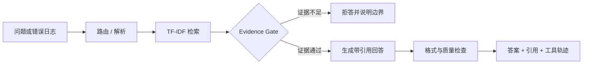

# DevAgent-RAG

面向 AI 开发文档与错误诊断的本地 RAG 原型。项目重点不是“检索到内容就回答”，而是把**检索、来源检查、拒答与可追踪输出**拆开，让技术诊断过程可以复查。

```text
问题 / 错误日志
  -> 路由与错误解析
  -> 本地文档检索
  -> Evidence Gate（来源不足则拒答）
  -> 模板或可选 LLM 生成
  -> 引用、质量检查与工具轨迹
```

## 项目解决的问题

开发文档问答很容易出现“关键词碰巧命中，就给出过度确定的建议”。DevAgent-RAG 将以下边界显式实现：

- 检索结果不等于证据；缺少来源时应拒答；
- GitHub Issue 可以提供真实问题线索，但不能自动当作官方修复结论；
- 对“保证修复”和缺少版本信息的版本特定命令，Evidence Gate 会阻止过度承诺；
- 可选 embedding / hybrid / reranker 并不默认启用，更不会在 fallback 时冒充语义检索结果。

## 架构


```mermaid
flowchart LR
    Q[问题或错误日志] --> R[路由 / 解析]
    R --> T[TF-IDF 检索]
    T --> E{Evidence Gate}
    E -->|证据不足| X[拒答并说明边界]
    E -->|证据通过| A[生成带引用回答]
    A --> C[格式与质量检查]
    C --> O[答案 + 引用 + 工具轨迹]
```

默认路径完全本地运行：TF-IDF、Evidence Gate、模板回答和测试均不要求 API key。配置 API 后，LLM 只在证据通过后参与最终回答生成。

## 当前可复核状态

- 真实来源评测使用独立索引：仅含 5 份带 URL、抓取时间和 SHA-256 的官方文档快照（不混入演示或上传文档），以及 8 条冻结烟雾题。
- 完整本地测试已通过 `84/84`。
- 8 条自动化烟雾题只验证“检索/拒答行为符合预设规则”，不是准确率或泛化率。在安装 requirements 并重建独立 sklearn TF-IDF 索引后，基线为 Hit@1 `5/5`、Hit@3 `5/5`、MRR `1.000`，且 3 条拒答探针全部通过；同一候选集上的 lexical reranker 没有测得额外收益，因此不默认启用。
- 项目不采用双人主观审核作为有效性依据。当前结论仅限于固定来源、冻结题目上的可复现检索与拒答行为；不宣称真实用户满意度、事实正确性或泛化效果。
- 另有 5 条公开 GitHub Issue 衍生的拒答控制题：Issue 原文不导入检索库，系统在缺少官方版本、发布说明或维护者结论时必须拒绝给出“保证修复”或版本特定命令。当前为 `5/5`；这是拒答边界测试，不是答案正确率评测。

## 快速开始

```powershell
python -m venv .venv
.\.venv\Scripts\Activate.ps1
pip install -r requirements.txt
python scripts\prepare_sample_docs.py
python scripts\build_index.py
python -m unittest discover -s tests
```

复核真实来源快照与上述小型检索对照：

```powershell
python scripts\fetch_curated_official_docs_v7.py
python scripts\build_index.py --config configs\real_source_eval_v7.yaml
python scripts\verify_real_source_manifest_v7.py
python scripts\real_source_eval_v7.py
python scripts\real_source_eval_v7.py --config configs\real_source_eval_v7_lexical_rerank.yaml --output-stem real_source_eval_v7_lexical_rerank
python scripts\real_source_eval_v7.py --cases data\evals\issue_derived_refusal_controls_v1.json --output-stem issue_derived_refusal_controls_v1
```

运行本地示例：

```powershell
python scripts\ask.py "How should I handle OpenAI API rate limits?"
python scripts\debug.py "CUDA out of memory"
```

## 代码结构

```text
src/       路由、检索、Evidence Gate、生成与质量检查
scripts/   索引、真实来源校验、评测与本地演示
tests/     不调用真实 API 的单元与集成测试
data/      示例文档、索引与本地评测产物（大文件/抓取内容不上传）
configs/   默认检索与运行配置
```

## 公开展示边界

GitHub 只保留最终代码、最终说明和可复核摘要。原始抓取文本、缓存、工具轨迹、未填写的人审表及过程性审计不作为公开展示内容。

## 非目标

- 不是托管知识库或生产客服系统；
- 不把 TF-IDF fallback 描述成 embedding/hybrid 的效果；
- 不在没有真实失败证据时叠加多 Agent、MCP 或复杂 UI；
- 不把自动化烟雾测试表述为真实开发问题上的泛化能力。
